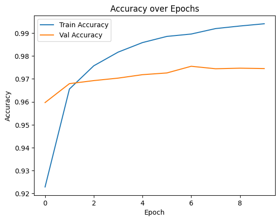
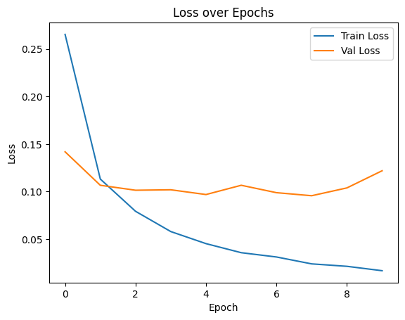

# Neural Networks with TensorFlow/Keras — MNIST Digit Classification

## Overview
This project is part of my Data Science internship at Codveda Technologies.  
The objective was to build, train, and evaluate a **feed-forward neural network** to classify MNIST handwritten digit images (0–9) using TensorFlow/Keras.

---

## Dataset
- **Source:** MNIST (Modified National Institute of Standards and Technology) dataset  
- **Total Samples:** 70,000 images (28x28 pixels, grayscale)  
- **Training Set:** 60,000 images  
- **Test Set:** 10,000 images  

---

## Project Workflow

### 1. Data Preprocessing
- Normalized pixel values to range **[0, 1]** for faster convergence.  
- Flattened 28×28 images into 784-dimensional vectors.  
- One-hot encoded labels (0–9) for categorical classification.  

### 2. Model Architecture
- **Input Layer:** 784 neurons (flattened image pixels)  
- **Hidden Layer 1:** Dense(128), ReLU activation  
- **Hidden Layer 2:** Dense(64), ReLU activation  
- **Dropout:** 0.2 for regularization  
- **Output Layer:** Dense(10), Softmax activation  

### 3. Training Configuration
- **Optimizer:** Adam  
- **Loss Function:** Categorical Crossentropy  
- **Metrics:** Accuracy  
- **Epochs:** 10  
- **Batch Size:** 32  

### 4. Evaluation
- Plotted **accuracy and loss curves** for both training and validation sets.  
- Evaluated model performance on test set.  

---

## Results
- **Test Accuracy:** **0.98**  
- **Test Loss:** **0.09**  
- Validation accuracy consistently above **97%** after epoch 2.  
- Loss stabilized in later epochs, with minor fluctuations due to dropout.  

---

## Visualizations

### Accuracy Curve


### Loss Curve


---

## Key Learnings
- Neural networks require proper normalization and encoding for optimal performance.  
- Dropout helps prevent overfitting in deep learning models.  
- Accuracy and loss curves are essential for monitoring training stability.  

---

## Tech Stack
- **Python**  
- **TensorFlow / Keras**  
- **NumPy, Pandas**  
- **Matplotlib**  

---

## How to Run
```bash
pip install tensorflow numpy pandas matplotlib
python mnist_neural_network.py
