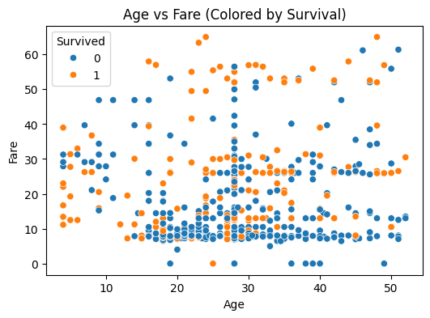
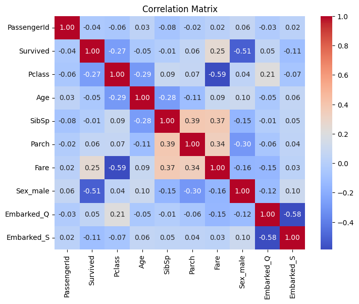

# Task 3: Exploratory Data Analysis (EDA) 📊

As part of my Data Science Internship at **Codveda Technologies**, this task involved exploring the Titanic dataset to uncover insights through summary statistics and visualizations.

## 📂 Dataset
- Titanic dataset (cleaned & normalized)

## ✅ What I Did
- **Summary Statistics**: Mean, median, variance of key features
- **Visualizations**:
  - Histograms for Age & Fare
    
  - Boxplots for spread & outliers
     
  - Scatter plot for Age vs Fare (colored by Survival)
    
  - Correlation heatmap for numerical features
    
- **Insights**: Observed patterns in survival, ticket prices, and passenger demographics

## 🧰 Tools Used
- Python
- pandas
- matplotlib
- seaborn

## 📁 Output
- Notebook: `titanic_eda.ipynb`
- Plots: Visualization plots

---

> #CodvedaJourney #CodvedaProjects #DataAnalysis #EDA #Pandas #Seaborn
